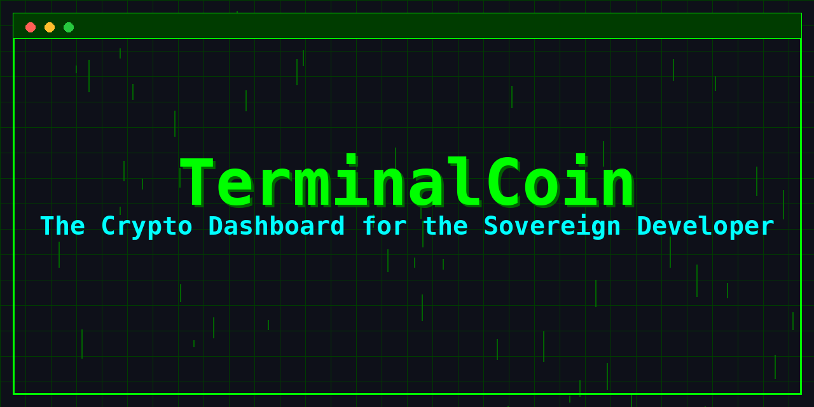
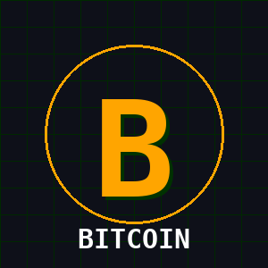
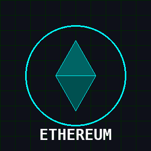
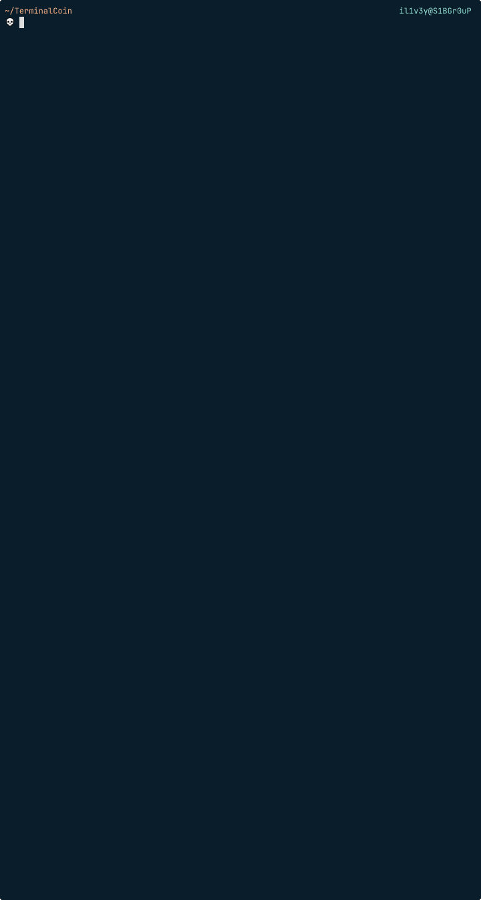

<div align="center">



### The Crypto Terminal Dashboard for the Sovereign Developer

[](https://coingecko.com)
[](https://coingecko.com)

[](https://python.org)
[](https://textual.textualize.io/)
[](LICENSE)

</div>

---

## ⚡ The Philosophy

**Web browsers are bloated.** Tracking scripts, heavy JavaScript, and distracting ads have no place in a trader's sanctuary.

**TerminalCoin** brings the market back to where it belongs: the Command Line. Fast, resource-efficient, and purely focused on data. It combines the raw power of `ssh` aesthetics with modern reactive UI technology.

> _"Don't trust, verify. Don't browse, curl."_

## 💎 Features

### Core Features

- **🚀 Real-Time Ticker:** Live price feeds for the top 100 cryptocurrencies via CoinGecko API
- **📉 ASCII Sparklines:** Visualize 7-day price trends directly in your terminal using character-based micro-charts
- **📰 Crypto News Feed:** Real-time news with sentiment analysis (Bullish/Bearish/Neutral)
- **🎨 Multiple Themes:** 6 beautiful themes (Matrix, Cyberpunk, Ocean Deep, Solar Flare, Midnight Purple, Monochrome)
- **⚡ Zero Latency UX:** Keyboard-driven navigation. No mouse required (but supported)
- **🐧 Linux Native:** Built for the ecosystem. Pipes, virtual environments, and raw speed

### Version 2.0 - Clean Code & Security 🔒

- **✅ Clean Architecture:** Modular design with separation of concerns
- **✅ Type Safety:** Full type hints and Pydantic validation
- **✅ Security First:** Input validation, output sanitization, rate limiting
- **✅ Error Handling:** Comprehensive exception handling and logging
- **✅ Testing:** Unit tests and test infrastructure
- **✅ Documentation:** Extensive docs (ARCHITECTURE.md, SECURITY.md, REFACTORING.md)

## 🔗 Supported Assets

We track the entire market, but we optimize for the kings:

<p align="center">
  
  
</p>

<p align="center">
  <b>BITCOIN [BTC]</b> - The Standard.&nbsp;&nbsp;&nbsp;&nbsp;&nbsp;&nbsp;&nbsp;&nbsp;
  <b>ETHEREUM [ETH]</b> - The Computer.
</p>

## 📸 Preview

<div align="center">



<br>
<i>Live Market Data. Zero Latency. Pure Terminal.</i>
</div>

## 🛠️ Installation

Get up and running in seconds.

```bash
# 1. Clone the repository
git clone https://github.com/ind4skylivey/TerminalCoin.git
cd TerminalCoin

# 2. Create a virtual environment (Recommended)
python3 -m venv venv
source venv/bin/activate  # Or 'source venv/bin/activate.fish' for fish users

# 3. Install dependencies
pip install -r requirements.txt
```

## 🎮 Usage

Launch the dashboard:

```bash
python app.py
```

### Controls

| Key      | Action                             |
| :------- | :--------------------------------- |
| `q`      | **Quit** the application           |
| `r`      | **Refresh** data immediately       |
| `Ctrl+P` | **Command palette** (change theme) |
| `Click`  | Select a coin to view details      |
| `↑/↓`    | Navigate the coin list             |

### Changing Themes

1. Press `Ctrl+P` to open the command palette
2. Type "theme" and select "Change theme"
3. Choose from: Matrix, Cyberpunk, Ocean Deep, Solar Flare, Midnight Purple, or Monochrome

## 📚 Documentation

- **[ARCHITECTURE.md](ARCHITECTURE.md)** - Code architecture and design patterns
- **[SECURITY.md](SECURITY.md)** - Security policy and best practices
- **[REFACTORING.md](REFACTORING.md)** - Version 2.0 refactoring details

## 🗺️ Roadmap

- [x] MVP Release (Live Prices)
- [x] Sparkline Charts
- [x] 📰 **Crypto News Feed** (RSS Integration)
- [x] 🎨 **Themes** (Matrix, Cyberpunk, Ocean, etc.)
- [ ] 👛 **Portfolio Tracker** (Local storage)
- [ ] 🔔 **Price Alerts** (Desktop notifications)

## 🤝 Contributing

Contributions are welcome. Fork the repo, create a branch, and push your code.
**Style Guide:** Keep it dark, keep it fast.

## 💸 Sovereignty Fund

If this tool helped you snipe a gem, consider feeding the developer's caffeine addiction.

<div align="center">

[](https://mempool.space/address/bc1qg4he7nyq4j5r8mzq23e8shqvtvuymtmq5fur5k)
[](https://etherscan.io/address/0x21C8864A17324e907A7DCB8d70cD2C5030c5b765)
[](https://solscan.io/account/BS3Nze14rdkPQQ8UkQZP4SU8uSc6de3UaVmv8gqh52e4)
[](https://www.getmonero.org/)

<br>


</div>

---

<div align="center">
Built with 💚 and ₿ by il1v3y
</div>
